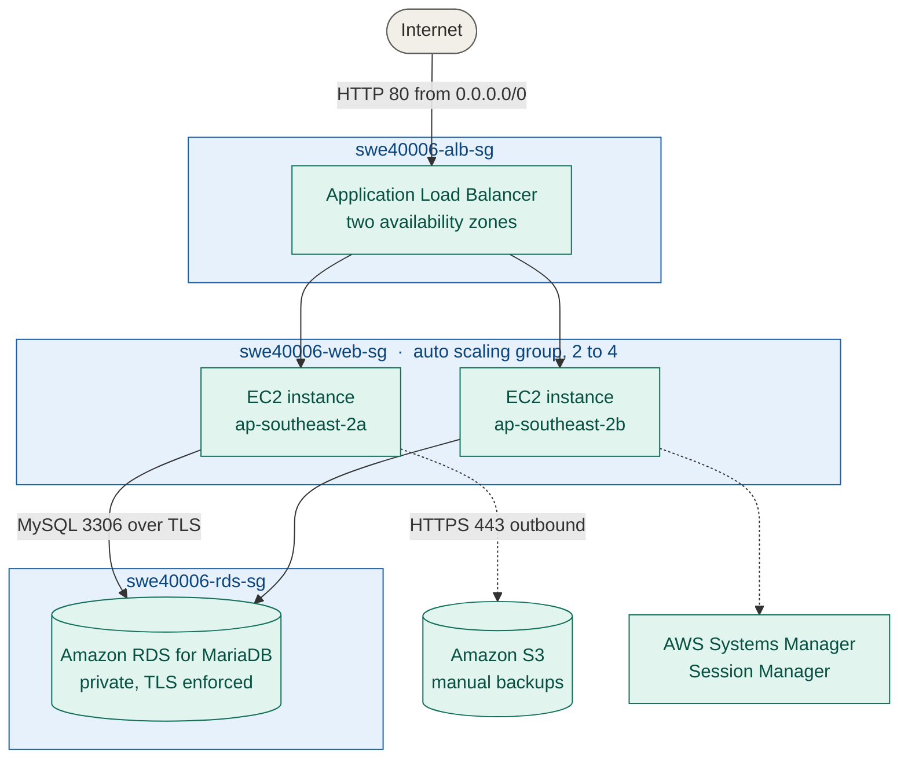

# SWE40006 — Deployment Portfolio Task 3

Scripts, IAM policies and configuration for a WordPress deployment on AWS, built for
Swinburne University unit **SWE40006 Software Deployment and Evolution**, Semester 2 2026.

**Declared target level:** High Distinction (Task 3.4)
**Region:** `ap-southeast-2` (Asia Pacific — Sydney)

This repository accompanies the submitted report. The report contains the annotated screenshots and the design rationale; this repository holds the scripts and policy documents referenced from it.

---

## What was built

A three-tier WordPress deployment, developed in four stages where each stage removes a weakness introduced by the previous one.

| Level | Added | Removed weakness |
|---|---|---|
| 3.1 Pass | EC2 instance with Apache, MariaDB, PHP and WordPress | — |
| 3.2 Credit | Amazon RDS for MariaDB; S3 backup and restore; IAM instance role | Application state tied to one instance; no backup |
| 3.3 Distinction | Golden AMI, launch template, ALB across two AZs, Auto Scaling Group (2–4) | Single point of failure; instances directly internet-facing |
| 3.4 High Distinction | CloudWatch alarm + SNS email; SSM Session Manager | No monitoring; open SSH port and key-based access |

### Final topology



No EC2 instance accepts inbound traffic from the internet. The only internet-facing listener is the ALB on port 80. Port 22 is not open on any security group.

---

## Repository contents

```
scripts/
  user-data.sh          Launch template boot script (ASG instances)
  provision-lamp.sh     LAMP installation for a bare instance
  backup-to-s3.sh       Create and upload application + database backups
  restore-from-s3.sh    Restore an application backup onto a fresh instance
iam/
  s3-backup-policy.json Least-privilege policy attached to the instance role
config/
  wp-config-snippet.php The wp-config.php directives added for this task
  health.html           Static ALB health check endpoint
docs/
  architecture.md       Resource inventory and security group matrix
  teardown.md           Ordered decommissioning procedure
```

---

## Configuration required before use

Every script reads its configuration from environment variables. Nothing is hardcoded and no credentials are stored in this repository.

```bash
export RDS_ENDPOINT="swe40006-rds.chm0e2oc24zi.ap-southeast-2.rds.amazonaws.com"
export S3_BUCKET="swe40006-backup-104809887"
export AWS_REGION="ap-southeast-2"
export DB_NAME="wordpress_db"
export DB_USER="wp_user"
```

Database passwords are never passed as arguments or environment variables — the scripts prompt for them interactively via the MySQL client's `-p` flag, so they do not appear in shell history or the process list.

---

## Notable implementation details

**TLS is mandatory on RDS.** Current RDS parameter groups set `require_secure_transport = ON`. Every client connection supplies the regional CA bundle via `--ssl-ca`, and WordPress requires `define('MYSQL_CLIENT_FLAGS', MYSQLI_CLIENT_SSL)` because PHP's mysqli extension does not negotiate TLS by default. Disabling the parameter was rejected as a weakening of the security posture.

**Health checks target `/health.html`, not `/`.** WordPress answers `/` with a 302 redirect, which an ALB target group reads as unhealthy against its default success code of 200. The result is a loop of instances being terminated and replaced while the ALB serves 503. A static file returning a flat 200 decouples infrastructure health checking from application routing.

**`WP_HOME` and `WP_SITEURL` are set in `wp-config.php`.** WordPress stores its canonical URL in the database. Because every instance shares one RDS database, a stored instance IP would make all instances redirect to whichever one was configured last. Defining the constants in the config file overrides the stored values and is inherited by every instance launched from the AMI.

**Instance metadata is read via IMDSv2.** All metadata calls acquire a token first, mitigating server-side request forgery against the credential endpoint.

**Access is by IAM role, not access keys.** No long-lived credentials are written to any instance filesystem. The role carries a custom S3 policy scoped to a single bucket and three actions, plus `AmazonSSMManagedInstanceCore` for Session Manager.

---

## Known limitations

- `wp-content/uploads` is on instance-local storage and is not shared between instances or preserved across replacement. EFS or an S3 offload plugin would resolve this.
- The ALB listens on HTTP only. HTTPS requires an ACM certificate and a validated domain name; the `X-Forwarded-Proto` handling needed for it is already present.
- The Auto Scaling Group has fixed capacity and no scaling policy, as specified by the task.
- RDS is single-AZ, which is not free-tier eligible in Multi-AZ configuration.
- Infrastructure was created through the AWS Console rather than declared as code. Every parameter is recorded in `docs/architecture.md` to support conversion to CloudFormation or CDK.

---

## Attribution

Author: Karamjot Singh - 104809887 - Swinburne University of Technology
Unit: SWE40006 Software Deployment and Evolution, Semester 2 2026

A generative AI assistant was used for procedural research, error diagnosis and drafting assistance. All AWS configuration, command execution, testing and verification was performed by the author. See the Generative AI Declaration in the submitted report.
